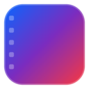

# Auto Scroll for Facebook Reels ⚡

A high-performance, modern Chrome Extension (Manifest V3) that automatically scrolls to the next Facebook Reel when the current video finishes playing. Inspired by the popular **Auto YouTube Shorts Scroller**, it gives you a hands-free viewing experience with customizable delays, shortcuts, ad skipping, and an on-screen HUD.



[](LICENSE)
[](manifest.json)
[](https://github.com/)

---

## ✨ Features

- **🚀 Automatic Video End Detection**: Overcomes Facebook's continuous video loop behavior using a triple-trigger detection engine (HTML5 `ended` listener, sub-second `timeupdate` threshold, and instant loop wrap-around tracking).
- **🔊 Auto-Unmute Audio**: Automatically enables sound when opening or refreshing Facebook Reels, bypassing Facebook's default muted playback.
- **🖱️ Draggable Floating HUD**: Click and drag the on-screen pill anywhere on your screen. The extension remembers your preferred position!
- **⚡ Snappy Manual Next Button**: Fast, responsive 320ms manual scrolling when you click the down arrow button on the HUD.
- **⌨️ Keyboard Shortcut Toggle**: Press **`Shift + D`** anywhere on Facebook Reels to toggle auto-scroll ON or OFF without touching your mouse.
- **🔂 Loop / Pin Current Reel**: Press **`Shift + L`** or click the loop button on the HUD to pin the current video and let it loop continuously.
- **⏱️ Configurable Delay (0s - 5s)**: Give yourself time to see the end of a video before it scrolls away. Includes an animated countdown bar.
- **🚫 Skip Sponsored Reels & Ads**: Automatically detects sponsored markers and fast-forwards past ads.
- **💬 Smart Typing & Comments Protection**: Automatically pauses auto-scroll while you have the comments pane open or are typing in a comment or message box.
- **🎨 Modern Glassmorphic Popup**: Beautiful dark mode settings dashboard to customize all preferences.
- **🔒 Privacy First & Lightweight**: Zero external trackers, zero ads, runs strictly on Facebook Reels.

---

## 📥 Installation (Chrome / Brave / Edge)

1. Open your browser and navigate to the Extensions management page:
   - **Chrome**: `chrome://extensions`
   - **Brave**: `brave://extensions`
   - **Edge**: `edge://extensions`
2. Enable **"Developer mode"** using the toggle in the top-right corner.
3. Click the **"Load unpacked"** button in the top-left corner.
4. Select this project folder:
   ```
   /home/agus/CODE/Fb-Auto-Scrool
   ```
5. The extension is now installed! You will see the **Reels Auto-Scroll** icon in your browser toolbar with an **`ON`** badge.

---

## 🎯 How to Use

1. Open any Facebook Reel, for example:
   👉 [https://www.facebook.com/reel/1236483950735204](https://www.facebook.com/reel/1236483950735204)
2. You will notice the floating **Auto-Scroll: ON** pill in the bottom-right corner.
3. When the Reel video finishes playing:
   - A smooth countdown progress bar will appear on the HUD pill.
   - The player will automatically scroll down to the next Reel.
4. Use **`Shift + D`** to toggle auto-scroll at any time.
5. Click the extension icon in your toolbar to adjust the scroll delay (default: 1.0 second) or enable audio cues.

---

## ⌨️ Shortcuts Reference

| Shortcut                                         | Action                                                   | Scope                  |
| :----------------------------------------------- | :------------------------------------------------------- | :--------------------- |
| <kbd>Shift</kbd> + <kbd>D</kbd>                  | Toggle Auto-Scroll ON / OFF                              | In-page (Reels viewer) |
| <kbd>Shift</kbd> + <kbd>L</kbd>                  | Loop / Pin current reel (pauses scrolling for this reel) | In-page (Reels viewer) |
| <kbd>Alt</kbd> + <kbd>Shift</kbd> + <kbd>D</kbd> | Global browser command shortcut                          | Global Chrome command  |

---

## 📁 Project Structure

```
Fb-Auto-Scrool/
├── manifest.json              # Chrome Extension Manifest V3 configuration
├── background/
│   └── service-worker.js      # Extension badge manager & hotkey router
├── content/
│   ├── audioManager.js        # Automatic unmuting on load and route changes
│   ├── content.js             # Main coordinator & settings synchronization
│   ├── detector.js            # Active video tracker & end/loop detection engine
│   ├── scroller.js            # Synthetic keyboard ArrowDown navigation & fallbacks
│   ├── sponsorSkip.js         # Sponsored reel & ad detector
│   ├── hud.js                 # Floating HUD status pill & countdown timer
│   └── content.css            # Dark glassmorphism styles for HUD & toasts
├── popup/
│   ├── popup.html             # Extension settings dashboard
│   ├── popup.css              # Custom dark-mode glassmorphic styling
│   └── popup.js               # Settings persistence with chrome.storage.local
├── icons/                     # Icons (16px, 32px, 48px, 128px, and vector SVG)
├── LICENSE                    # MIT Open Source License
└── README.md                  # Documentation, credits & store guide
```

---

## 🛠️ Technical Implementation Details

Facebook Reels uses dynamic client-side rendering (React) with obfuscated class names (`x1lliihq...`) and loops videos by default:

1. **Navigation Engine**: Instead of fragile class selectors, the extension dispatches synthetic `KeyboardEvent('keydown', { key: 'ArrowDown', keyCode: 40 })` events directly to the window and active container. This mirrors Facebook's official keyboard navigation.
2. **Loop Interception**: Facebook Reels often loop back to `0:00` without triggering a standard `ended` event. The detector observes both `currentTime >= duration - 0.35s` and sudden wrap-around time jumps (`previousTime > duration - 1.2s` and `currentTime < 0.4s`).
3. **Debounce Locks**: To prevent fast runaway scrolls on short videos or buffering delays, a 1.4-second hardware debounce lock guards each transition.

---

## 🙏 Acknowledgments & Inspiration

This project was made possible by studying existing community solutions and standing on the shoulders of giants:

- **[Tyson3101](https://github.com/Tyson3101)** – Creator of **[Auto YouTube Shorts Scroller](https://chromewebstore.google.com/detail/auto-youtube-shorts-scrol/ckbnikemebopgknkpgjlkbffpkkhblbe)** ([GitHub Repository](https://github.com/Tyson3101/Auto-Youtube-Shorts-Scroller)). Tyson's work set the industry standard for short-form video auto-scrolling UX, keyboard shortcuts (`Shift + D`), and delay configurations that served as the prime inspiration for this project.
- **[Shalinga Manasinghe (@shalingams)](https://github.com/shalingams)** – Creator of **[fb-reels-auto-scroll](https://github.com/shalingams/fb-reels-auto-scroll)**, whose open-source project pioneered early techniques for scrolling Facebook Reels on the web.
- **[Duy Hiển](https://greasyfork.org/en/users/1198647)** – Author of the **[Auto Facebook Reels Scroller](https://greasyfork.org/scripts/477435-auto-facebook-reels-scroller)** userscript on Greasy Fork, providing helpful community reference for Facebook video DOM lifecycle handling.

---

## 🤝 Contributing

Contributions, issues, and feature requests are welcome!
Feel free to open an issue or submit a pull request if you want to add new features, support other locales, or improve performance.

1. Fork the Project
2. Create your Feature Branch (`git checkout -b feature/AmazingFeature`)
3. Commit your Changes (`git commit -m 'Add some AmazingFeature'`)
4. Push to the Branch (`git push origin feature/AmazingFeature`)
5. Open a Pull Request

---

## 📄 License & Disclaimer

- **License**: Distributed under the [MIT License](LICENSE).
- **Disclaimer**: This is an independent open-source project and is **not affiliated with, associated with, authorized by, endorsed by, or in any way officially connected with Meta Platforms, Inc. or Facebook**. "Facebook" and "Facebook Reels" are registered trademarks of Meta Platforms, Inc.
